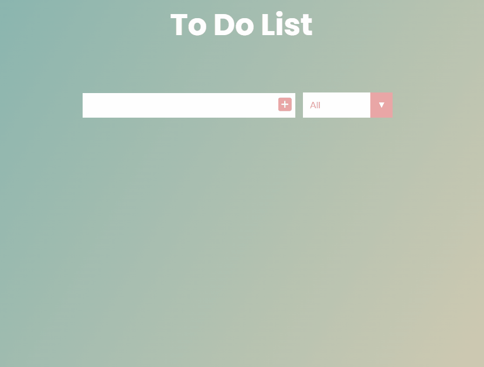

# To Do List

Someone told me that making a to do list is _essential_ while learning JavaScript, so I made one! I've implemented the logic using the **Dev Ed** tutorial (buy his js course, he's awesome!) and tweaked the colors a bit to be more my style.

### Features:

- Check and delete buttons;
- All, complete and uncompleted filter;
- Works in Local Storage.

